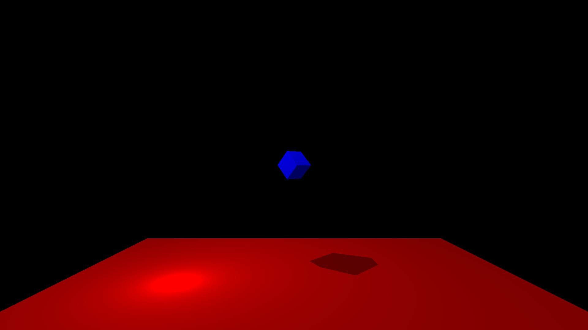

# README
This projects goal is to make a simple raytracer with only cubes as 3D models.

## Example image

## Build
    Build the project :
        make        -> Builds the main program (-O3).
        make run    -> Builds and runs the main program (-O3).

        make debug  -> Builds the main program in debug mode (-g -O0)

        make clean  -> Cleans the trash files created by make and the main program.

        make doc    -> Make the html and latex documentation
                        html is in "html/index.html"
                        latex is in "latex/refman.pdf"

## Usage
The usage is juste ./main for now.

## AUTHORS
Sébastien GOUBEAU (sebastiengou@outlook.fr)